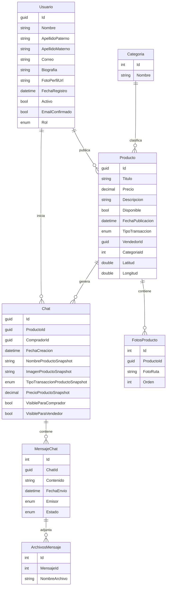

# API ASP Net Core Para Sistema de Marketplace
Esta api formó parte de un proyecto universitario, del cual, esta API tiene el objetivo de ser el *Backend*. Dicho proyecto también es constituido por un Sitio Web y una Aplicación Movil que consumiran la API que aqui se publica.

## Caracteristicas de esta API
### Autenticación
Para la autenticación de usuarios es utilizado el sistema JWT, que genera un token de autenticación único cada vez que un usuario inicia sesión. Para utilizar la mayoria de endpoints de esta api, es requerido un token válido que viaje junto a la peticion a los endpoints. El token es proporcionado por la API al iniciar sesión.

### Arquitectura
1. La API se basa en el **Patrón de Diseño Estructural MVC**, con controladores definidos que reciben las peticiones, definiendo la estructura general de la API.
1. Se hace uso de **Docker** para levantar dos servicios simultaneamente (La API, y una instancia de SQL Server) como contenedores.
1. Se hace uso de diversos patrones de diseño para mantener un orden, limpieza de datos, y separación de responsabilidades entre las diferentes capas de la API, por ejemplo:
    - **DTO**. Este patrón se implementó para separar las entidades del dominio de los datos intercambiados con el cliente, con el fin de no exponer dichas entidades directamente al cliente.
    - **Inyección de Dependencias (DI)**. Se utilizó inyección de dependencias para desacoplar los controladores de la implementación concreta de los servicios, facilitando el mantenimiento, pruebas y reutilización de código.

### Base de Datos
1. Como *SGBD* se hace uso de *Microsoft SQL Server.*
1. La estructura de Base de Datos se creó bajo el concepto de *Code First*, haciendo uso de *Enity Framework* para ASP Net Core

#### Diagrama ER Sobre la Base de Datos

## ¿Como Probar el Proyecto?
Este proyecto puede ser probado tanto en Linux como en Windows
### Requisitos Previos
1. Debes tener instalado **Docker** y **Docker Compose**.

### Instrucciones para Probar el Proyecto
1. **Clona el Repositorio** con `git clone` o **Descarga el Archivo ZIP** del proyecto de este mismo repo
1. Abre una terminal dentro de la carpeta `api-tienda-web-odi`
1. Una vez dentro de la carpeta en la terminal, solo ejecuta el comando `docker compose up -d`, el cual creará dos contenedores **Docker**, uno para la **API** y otro para la **BD**. Este proceso puede tomar unos minutos debido a la descarga de la imagen para el contenedor de **SQL Server**
1. Una vez que los contenedores esten ejecutandose, podrás probar los endpoint de la **API** directamente con **Swagger** al abrir en un navegador `http://localhost:8080/swagger/index`, o también con algun programa externo como **Postman**